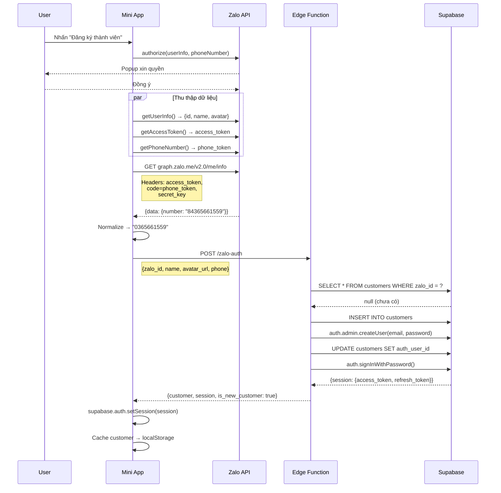
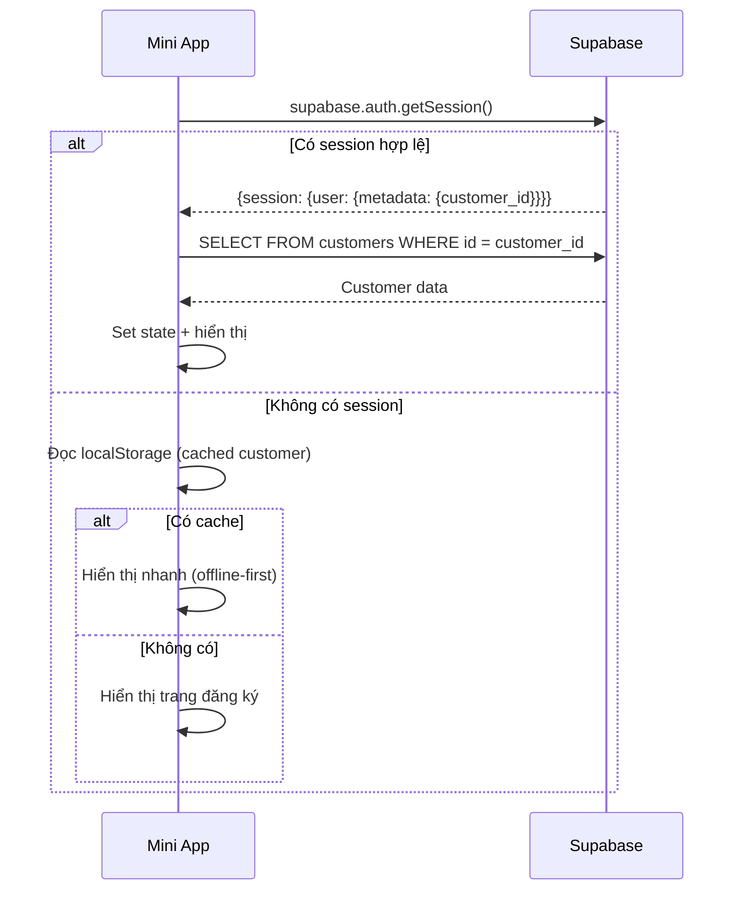

# Hệ thống Đăng nhập & RLS — Zalo Mini App

## 1. Tổng quan kiến trúc

```mermaid
flowchart LR
    subgraph Client ["Mini App (VN IP)"]
        A[Zalo SDK] --> B[Phone Decode]
        B --> C[Supabase Client]
    end
    subgraph Server ["Supabase (Singapore)"]
        D[Edge Function<br/>zalo-auth]
        E[auth.users]
        F[public.customers]
        G[RLS Policies]
    end
    C -->|POST /zalo-auth| D
    D --> E
    D --> F
    E -.->|auth.uid()| G
    G -.->|protect| F
```

---

## 2. Luồng Đăng ký (Lần đầu)



### Chi tiết từng bước

#### Bước 1 — Client: Thu thập dữ liệu
File: [zalo-auth.ts](file:///d:/IMEI/imei-miniapp/src/services/zalo-auth.ts)

```typescript
// 1. Xin quyền
await authorize({ scopes: ["scope.userInfo", "scope.userPhonenumber"] });

// 2. Lấy thông tin song song
const [profile, phoneToken, accessToken] = await Promise.all([
  getUserInfo(),      // → {id, name, avatar}
  getPhoneNumber(),   // → {token: "encrypted..."}
  getAccessToken(),   // → "access_token_string"
]);
```

#### Bước 2 — Client: Decode phone (VN IP)
```typescript
// Gọi Zalo Graph API trực tiếp từ client (chạy trên điện thoại = IP Việt Nam)
const res = await fetch("https://graph.zalo.me/v2.0/me/info", {
  headers: {
    access_token: accessToken,       // từ getAccessToken()
    code: phoneToken,                // từ getPhoneNumber().token
    secret_key: VITE_ZALO_APP_SECRET // "mQUu6N5cPp6h2GuV7x8P"
  },
});
// Response: { data: { number: "84365661559" }, error: 0 }
// Normalize: "84365661559" → "0365661559"
```

> **Tại sao decode ở client?** Zalo Graph API chỉ cho phép gọi từ IP Việt Nam. Edge Function chạy ở Singapore nên bị chặn (error -501).

#### Bước 3 — Edge Function: Upsert + Auth
File: Edge Function `zalo-auth` (v5)

```
POST /functions/v1/zalo-auth
Body: { zalo_id, name, avatar_url, phone }
```

Logic upsert:
1. Tìm `customers` theo `zalo_id` → nếu có → UPDATE
2. Tìm `customers` theo `phone` → nếu có → merge (gắn `zalo_id`)
3. Không tìm thấy → INSERT mới

Sau upsert, tạo Supabase Auth user:
```
Email: zalo_{zalo_id}@miniapp.local
Password: zalo_{zalo_id}_{service_role_key_prefix}
```

---

## 3. Luồng Đăng nhập lại (Auto-login)



File: [atoms.ts](file:///d:/IMEI/imei-miniapp/src/state/atoms.ts) → `autoLoginAtom`

Supabase tự quản lý session refresh token, nên user không cần đăng ký lại trừ khi session hết hạn hoàn toàn.

---

## 4. Luồng Đăng xuất

```typescript
// atoms.ts → logoutAtom
set(customerAtom, null);
set(myImeisAtom, []);
set(myOrdersAtom, []);
clearAuthCache();                    // Xóa localStorage
await supabase.auth.signOut();       // Xóa Supabase session
```

---

## 5. Cấu trúc Database

### Bảng `public.customers`
| Cột | Type | Mô tả |
|-----|------|-------|
| `id` | uuid (PK) | ID customer |
| `phone` | text (UNIQUE) | SĐT đã normalize (0365661559) |
| `name` | text | Tên hiển thị |
| `zalo_id` | text (UNIQUE) | Zalo user ID |
| `zalo_name` | text | Tên Zalo |
| `avatar_url` | text | URL ảnh đại diện Zalo |
| **`auth_user_id`** | uuid (FK → auth.users.id) | **Link tới Supabase Auth** |
| `created_at` | timestamptz | Ngày tạo |

### Bảng `auth.users` (Supabase quản lý)
| Cột quan trọng | Giá trị |
|----------------|---------|
| `email` | `zalo_{zalo_id}@miniapp.local` |
| `user_metadata.zalo_id` | Zalo user ID |
| `user_metadata.customer_id` | `customers.id` |
| `user_metadata.name` | Tên user |

### Mối quan hệ
```
auth.users.id  ←——→  customers.auth_user_id
    │
    └── auth.uid() ← dùng trong RLS policies
```

---

## 6. Thiết lập RLS

### Bước 1: Bật RLS trên các bảng

```sql
-- Bật RLS
ALTER TABLE public.customers ENABLE ROW LEVEL SECURITY;
ALTER TABLE public.imeis ENABLE ROW LEVEL SECURITY;
ALTER TABLE public.orders ENABLE ROW LEVEL SECURITY;
ALTER TABLE public.order_items ENABLE ROW LEVEL SECURITY;
```

### Bước 2: Policy cho bảng `customers`

```sql
-- Customer chỉ đọc được row của chính mình
CREATE POLICY "customers_select_own" ON public.customers
  FOR SELECT
  USING (auth_user_id = auth.uid());

-- Customer có thể update thông tin của mình
CREATE POLICY "customers_update_own" ON public.customers
  FOR UPDATE
  USING (auth_user_id = auth.uid())
  WITH CHECK (auth_user_id = auth.uid());

-- Chỉ Edge Function (service_role) được INSERT
-- (Không cần policy vì service_role bypass RLS)
```

### Bước 3: Policy cho bảng `imeis`

```sql
-- Customer chỉ xem IMEI của mình
CREATE POLICY "imeis_select_own" ON public.imeis
  FOR SELECT
  USING (
    customer_id IN (
      SELECT id FROM public.customers 
      WHERE auth_user_id = auth.uid()
    )
  );
```

### Bước 4: Policy cho bảng `orders`

```sql
-- Customer chỉ xem đơn hàng của mình
CREATE POLICY "orders_select_own" ON public.orders
  FOR SELECT
  USING (
    customer_id IN (
      SELECT id FROM public.customers 
      WHERE auth_user_id = auth.uid()
    )
  );

-- Customer được tạo đơn hàng
CREATE POLICY "orders_insert_own" ON public.orders
  FOR INSERT
  WITH CHECK (
    customer_id IN (
      SELECT id FROM public.customers 
      WHERE auth_user_id = auth.uid()
    )
  );
```

### Bước 5: Policy cho bảng chỉ đọc (catalog)

```sql
-- Ai cũng đọc được categories, products, packages (public data)
CREATE POLICY "categories_select_all" ON public.categories
  FOR SELECT USING (true);

CREATE POLICY "products_select_all" ON public.products
  FOR SELECT USING (true);

CREATE POLICY "packages_select_all" ON public.packages
  FOR SELECT USING (true);
```

### Bước 6: Policy cho `order_items`

```sql
CREATE POLICY "order_items_select_own" ON public.order_items
  FOR SELECT
  USING (
    order_id IN (
      SELECT o.id FROM public.orders o
      JOIN public.customers c ON o.customer_id = c.id
      WHERE c.auth_user_id = auth.uid()
    )
  );
```

---

## 7. Kiểm tra RLS hoạt động

```sql
-- Test: Giả lập user đang đăng nhập
-- (Chạy trong Supabase SQL Editor với role = authenticated)

-- Xem auth.uid() hiện tại
SELECT auth.uid();

-- Thử đọc customers → chỉ thấy row của mình
SELECT * FROM customers;

-- Thử đọc orders → chỉ thấy đơn của mình
SELECT * FROM orders;
```

---

## 8. Biến môi trường

### Client (.env)
| Key | Giá trị | Mục đích |
|-----|---------|----------|
| `VITE_SUPABASE_URL` | `https://nhsshlpvcqudxdroxzsw.supabase.co` | Supabase API |
| `VITE_SUPABASE_ANON_KEY` | `eyJ...` | Public key cho client |
| `VITE_ZALO_APP_SECRET` | `mQUu6N5cPp6h2GuV7x8P` | Decode phone token |
| `VITE_ZALO_APP_ID` | `1557839404030109243` | Zalo App ID |

### Edge Function (Supabase Secrets)
| Key | Mục đích |
|-----|----------|
| `SUPABASE_URL` | Tự động có |
| `SUPABASE_SERVICE_ROLE_KEY` | Tự động có — bypass RLS |
| `ZALO_APP_SECRET_KEY` | Không dùng nữa (v5 đã bỏ server verify) |

---

## 9. Cấu trúc File

```
src/
├── lib/supabase.ts          # Supabase client init (anon key)
├── services/zalo-auth.ts    # Zalo SDK + phone decode + Edge Function call
├── state/atoms.ts           # registerMemberAtom, autoLoginAtom, logoutAtom
├── types/index.ts           # Customer, AuthResponse (session-based)
├── components/layout.tsx    # Gọi autoLogin khi app khởi động
└── pages/
    ├── auth/index.tsx       # UI đăng ký + loading/error states
    └── account/index.tsx    # Avatar + nút đăng xuất
```
